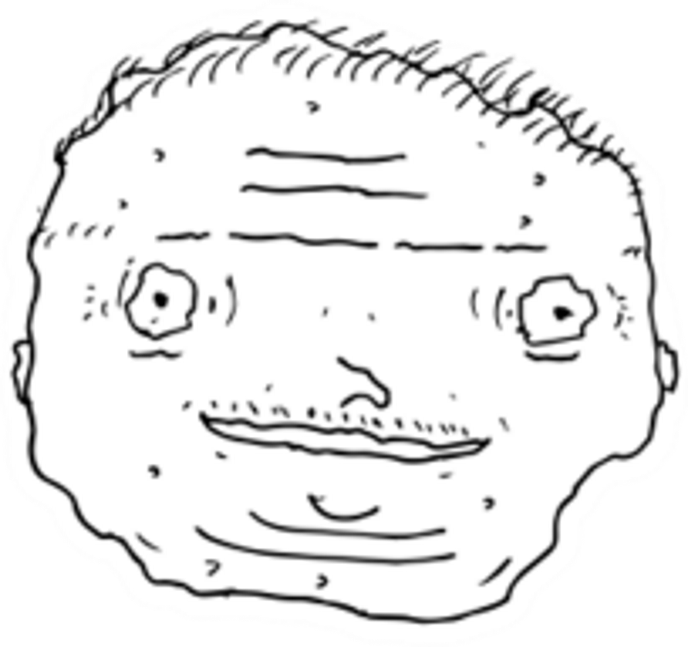

<link rel="stylesheet" href="{{ '/css/homepage.css' | url }}">

	

		

		
<i>Me, early 21st century</i>

	

	
I, Oliver, am <i>officially</i> online...

	
...at my <a href="/work/">portfolio</a>,

	
...at <a href="/blog/">my blog, which rocks</a>,

	
...and at my:

